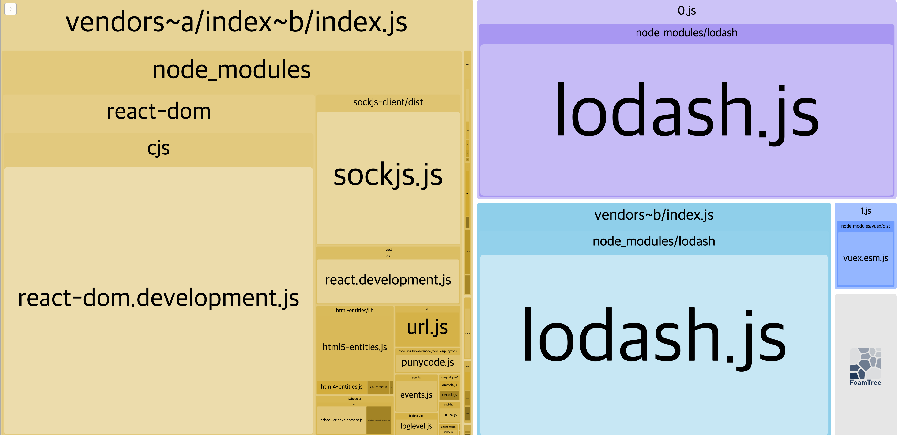
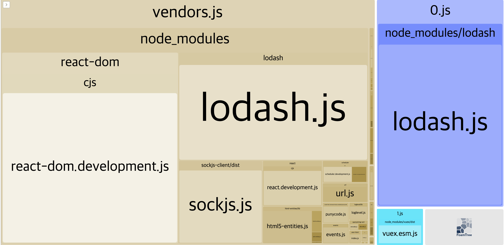

# SplitChunk

## 설명
- 디폴트로 웹팩이 해주기는 한다.
- 스플리팅 대상
    - `/node_modules`
    - 20KB 이상 (미니파이, gzip 전 기준)
- 청크 용량이 커질 수도 있는 경우
    - 청크를 load하는 최대 동시 요청 수가 30 이하가 아닐 것으로 예상될 때
    - 초기 페이지 load 시 발생하는 동시 요청 수가 30 이하가 아닐 것으로 예상될 때
- 주의 사항
    - 디폴트 설정은 웹에 가장 적합한 조건이므로, 설정 별로 얼만큼의 효율이 발생하는지 비교해서 사용하라.
## name
- `cacheGroups`의 옵션으로도 가능
- `name` 옵션을 줄 경우 하나의 청크 파일로 생성된다.
  - `production 모드`에서 `name` 옵션을 추천


## chunks
- initial / async (default) / all
- 비동기로 불리는 모듈은 옵션과 상관없이 항상 번들링된다. (async 옵션과 동작이 동일)
  - 단, `entry 파일들`끼리 **공통으로 가져오는 모듈**인 경우 `chunks 옵션`의 영향을 받는다.

```javascript
// A.js
import ('lodash');
import ('vuex');
import ('react');
import 'react-dom';

// B.js
import 'lodash';
import ('react');
import 'react-dom';
```
```javascript
const entry = [ A.js, B.js]
const output = [a.js, b.js]
const optimizationOption = {
    splitChunks: {
        chunks: 'async', // OR 'initial' OR 'all',
        // name: 'vendors'
    }
}
```
1. initial
      
   {: width="300" height="100"}
   {: width="300" height="100"}
- name 지정 안한 경우
  - a.js, b.js: 모듈 번들링 안됨
  - 0.js: 비동기로 불린 `lodash`
  - 1.js: 비동기로 불린 `vuex`
  - vendors~b.js: 동기로 불린 `lodash` 
  - vendors~a.js~b.js: 둘 다에서 동기, 비동기로 불린 `react`, `react-dom`
- name 지정한 경우
  - a.js, b.js: 모듈 번들링 안됨
  - 0.js: 비동기로 불린 `lodash`
  - 1.js: 비동기로 불린 `vuex`
  - [name].js: 동기로 불린 `lodash`과 둘 다에서 동기, 비동기로 불린 `react`, `react-dom`
로
2. async
- name 지정 안한 경우
  - a.js: `react`, `react-dom`
  - b.js: `react`, `react-dom`, 동기로 불린 `lodash`
  - 0.js: 비동기로 불린 `lodash`
  - 1.js: 비동기로 불린 `vuex`
- name 지정한 경우
  - a.js: `react`, `react-dom`
  - b.js: `react`, `react-dom`, 동기로 불린 `lodash`
  - [name].js: 비동기로 불린 `lodash`, `vuex`

3. all
- name 지정 안한 경우
  - a.js, b.js: 모듈 번들링 안됨
  - 0.js: 둘 다에서 동기, 비동기로 불린 `lodash`
  - 1.js: 비동기로 불린 `vuex`
  - vendors~a.js~b.js: 둘 다에서 동기, 비동기로 불린 `react`, `react-dom`
- name 지정한 경우
  - a.js, b.js: 모듈 번들링 안됨
  - [name].js: 둘 다에서 동기, 비동기로 불린 `react`, `react-dom`, `lodash`, `vuex` 

### Webconsole 의 경우..
- client.js
  - output 파일 
  - client/ 하위의 모든 코드가 번들링됨
  - assets, store 등 (옵션에 따라 node_modules도 포함됨)
- vendor~client
  - `name` 옵션을 지정하지 않은 경우, `client.js`에서 `node_modules`만 번들링
- 그 외
  - 비동기로 불리는 모듈들이 각각 번들링
- `name` 옵션을 지정한 경우
  - (vendor~client + 그 외)가 번들링

1. initial
- name X
  - clients.js: 2.1mb => assets, store 등
  - vendors~client : 9.2mb => node_modules
- name O
  - 위와 동일

2. async
- name X
  - client.js: 11.4mb => node_modules, assets, store 등
  - 나머지 엄청 여러개 생성
    - 라우터 코드 스플리팅으로 비동기로 불리는 애들에서 공통으로 import 되는 모듈들만 뽑아서 생성됨.
- name O
  - client.js: 11.3mb
  - vendors: 5.6mb
    - 나머지 엄청 여러개를 합친 것보다 크다.
  

3. all
- name X
  - client.js : 2.2mb => assets, store 등
  - vendors~client : 9.2mb => node_modules
  - 나머지 엄청 여러개 
    - 라우터 코드 스플리팅으로 비동기로 불리는 애들에서 공통으로 import 되는 모듈들만 뽑아서 생성됨.
    - 근데.. 2개 이하에서 import되는 모듈들은 안뽑아주는거 같고.. 이름 지정하면 걔네까지 다 뽑힘 
    - 그래서 이 나머지 + vendors~client 의 크기보다 vendors의 크기가 더 크다.
- name O
  - client.js: 2.1mb
  - vendors: 14.7mb
  

---
### 참고 링크
- chunks
  - https://webpack.js.org/plugins/split-chunks-plugin/#defaults
  - https://simsimjae.medium.com/webpack4-splitchunksplugin-%EC%98%B5%EC%85%98-%ED%8C%8C%ED%97%A4%EC%B9%98%EA%B8%B0-19f5de32425a
  - https://www.zerocho.com/category/Webpack/post/58ad4c9d1136440018ba44e7
  - https://hoilzz.github.io/webpack/6-code-split/
  - https://negabaro.github.io/archive/webpack-splitChunks
